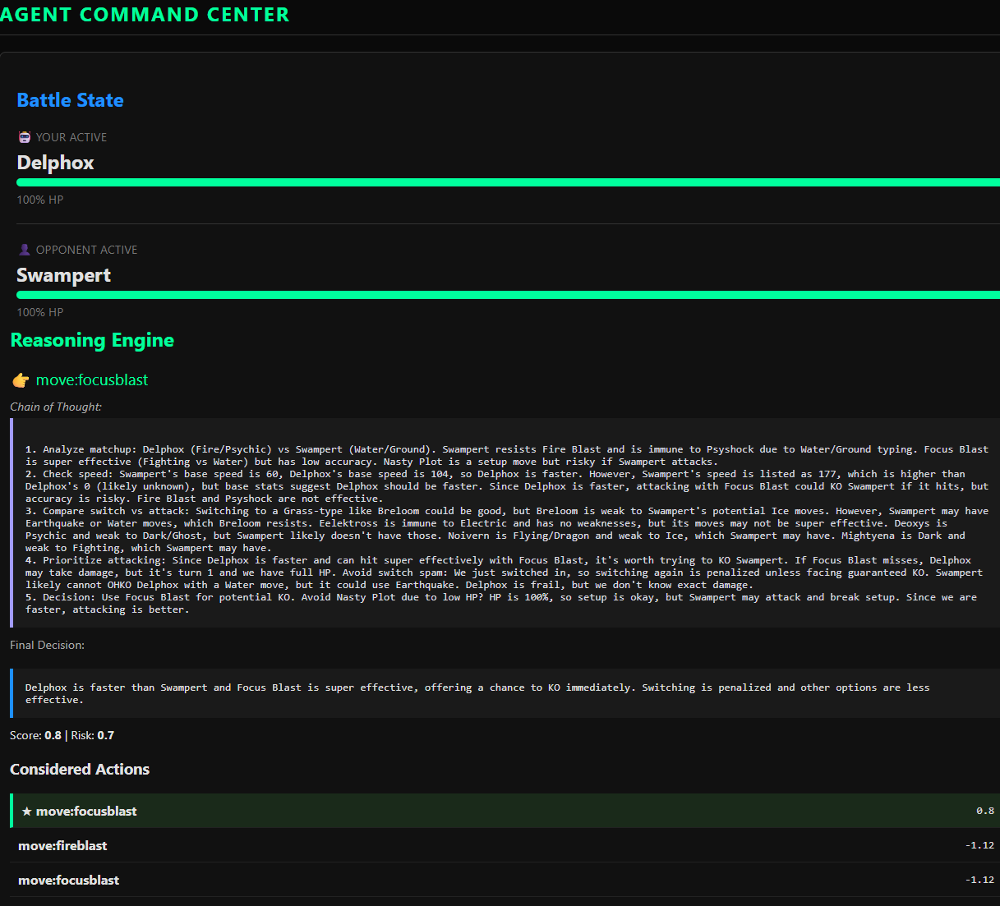

# Pokemon Showdown Random Battle AI Agent


<p align="right">
  <a href="https://github.com/Ricardouchub/pokemonshowdown-random-battle-ai-agent/blob/main/README-spanish.md">
    README Spanish
  </a>
</p>

This is an **advanced autonomous agent** designed to compete in **Pokemon Showdown (Random Battles)**. Its hybrid architecture combines the speed of classical algorithms with the deep reasoning of Large Language Models (LLMs).

Additionally, the agent possesses **self-learning** capabilities: it is able to adapt its strategy as battles unfold through the *Observed Effectiveness* system (learning immunities/resistances in real-time) and refine its long-term knowledge base via *Knowledge Feedback Loops*.

> [!WARNING]
> **Important Notice**: This agent is strictly designed for use on **private local servers** or controlled environments where bots are permitted. Using it on the official Pokemon Showdown server (play.pokemonshowdown.com) may violate the Terms of Service and result in a ban.

<br>
<p align="center">
  
</p>
<br>


### Features
*   **Real-time Connectivity**: Asynchronous WebSocket client that plays live matches against humans.
*   **Continuous Learning**: "Observed Effectiveness" system that learns from resistances/immunities in real-time and offline pipelines to improve its knowledge base.
*   **Observability**: Full web dashboard to visualize the agent's "thought process" turn by turn.
*   **Modular**: Decoupled design (Connector ↔ State ↔ Policy) that facilitates experimentation with new models or rules.

### Hybrid Architecture
The agent operates under a **"Dual Cognitive System"**:
1.  **Fast System (Baseline)**: A deterministic engine based on **Minimax (Lookahead 1-ply)** and damage/risk evaluation heuristics. It ensures safe and legal decisions in milliseconds.
2.  **Slow System (LLM Policy)**: A model in the loop that analyzes the complex board state, infers opponent sets, and suggests high-level strategies (Chain of Thought).

### Chain of Thought (Reasoning)
The agent doesn't just choose moves, it **thinks**. The system prompt includes "CRITICAL STRATEGIC RULES" such as:
1.  **Check Speed**: Before attacking, verify if you are faster by checking the Pokedex.
2.  **Avoid Switch Spam**: Penalize consecutive switches if not forced.
3.  **Analyze Matchup**: Evaluate types and status before acting.

The LLM response is a structured JSON that includes a `chain_of_thought` field where it explains its logic step-by-step (e.g., *"Garchomp is faster than me, I must switch to Skarmory to resist the Ground attack"*). This allows for auditing and debugging continuous complex strategies.

## Custom Architecture
This project implements a **100% Custom Python** architecture designed specifically for real-time battles, avoiding the overhead of generic frameworks like LangChain or AutoGen.
- **Low Latency Core**: Optimized decision pipeline operating in milliseconds.
- **Direct LLM Integration**: Proprietary `DeepseekClient` without intermediate abstraction layers.
- **Hybrid Intelligence**: Deterministic fusion (Minimax/Heuristics) + Probabilistic (LLM) with total control over the flow.

<br>
<p align="center">
  
</p>
<br>

## Requirements
- Python 3.11+
- [uv](https://github.com/astral-sh/uv)
- Local Pokemon Showdown Server: [Installation Guide](https://github.com/smogon/pokemon-showdown/blob/master/server/README.md)
- Optional: `DEEPSEEK_API_KEY` in `.env`, or exchange it for any other LLM.

## Quick Setup
```bash
uv venv
uv sync --all-extras
```

## Commands
- Live runner (LLM Policy): `uv run python -m ps_agent.runner.live_match --server-url ws://localhost:8000/showdown/websocket --http-base https://play.pokemonshowdown.com --username CodexBot --autojoin lobby --policy llm`
- Live runner (Baseline Policy): `uv run python -m ps_agent.runner.live_match --server-url ws://localhost:8000/showdown/websocket --http-base https://play.pokemonshowdown.com --username CodexBot --autojoin lobby --policy baseline`
- Dashboard Web App: `uv run python -m ps_agent.tools.web_dashboard`
- Tests: `uv run pytest`


## How the Live match runner works
`src/ps_agent/runner/live_match.py` connects the agent to a Showdown server via WebSocket. It handles `challstr`, gets the assertion (via `--http-base`), parses `|request|` JSON, updates `BattleState`, assembles the legal action set, and sends `/choose ...` using the selected policy (`baseline` or `llm`). Communication works (see `sending_battle_command` in console), but the server response remains blocked (see issues section).

Typical usage (local server at `http://localhost:8000`):
```bash
uv run python -m ps_agent.runner.live_match \
  --server-url ws://localhost:8000/showdown/websocket \
  --http-base https://play.pokemonshowdown.com \
  --username CodexBot \
  --autojoin lobby \
  --policy llm
```
Then challenge the agent from the web client. Each battle generates a JSONL log in `artifacts/logs/live/<battle-id>.log` with `legal_actions`, `top_actions`, and the evaluator breakdown.


## How the knowledge cache works
- `src/ps_agent/knowledge/online_agent.py`: uses PokeAPI for moves/items/abilities/type chart.
  ```bash
  uv run python -m ps_agent.knowledge.online_agent --move ember --item leftovers --ability levitate --type-chart
  ```
- `src/ps_agent/knowledge/fetch_cache.py`: CLI to load batches from lists/files.
- `src/ps_agent/knowledge/populate_pokedex.py`: Downloads stats from PokeAPI.
  ```bash
  # Bulk download
  uv run python -m ps_agent.knowledge.populate_pokedex --all
  # AI suggested download
  uv run python -m ps_agent.knowledge.populate_pokedex --count 50
  ```
- `src/ps_agent/runner/cache_agent.py`: fills the cache with a curated set of PokeAPI resources.
- `src/ps_agent/knowledge/deepseek_agent.py`: generates JSON profiles (pokemon/items/abilities) with Deepseek.
  ```bash
  uv run python -m ps_agent.knowledge.deepseek_agent --pokemon charizard --items life-orb --abilities levitate
  ```
- `src/ps_agent/runner/deepseek_cache_agent.py`: queries PokeAPI for names and automatically generates profiles with Deepseek.
  ```bash
  uv run python -m ps_agent.runner.deepseek_cache_agent --pokemon-limit 100 --item-limit 80 --ability-limit 80
  ```
- `src/ps_agent/knowledge/loader.py`: builds a `KnowledgeBase` from `data/knowledge_cache/` for the evaluator/policy.
- `artifacts/knowledge_feedback.jsonl`: log where the LLM leaves knowledge suggestions (successful/failed actions).


## How logging / metrics works
`EventLogger` places entries in `artifacts/logs/*.log` with:
- `state_summary` per turn
- Legal actions and top-k (score + breakdown)
- Evaluator reasons and extra fields (ranking, rival action)


## Project Structure

```text
pokemonshowdown-random-battle-ai-agent/
├── src/ps_agent/
│   ├── connector/          # Connection Layer
│   │   ├── client.py           # WebSocket Client (ShowdownClient)
│   │   └── protocol_parser.py  # Raw message to state translator
│   ├── knowledge/          # Knowledge Base
│   │   ├── pokedex_db.py       # Species DB and Stats
│   │   ├── populate_pokedex.py # Hybrid Script (LLM+API) to populate DB
│   │   ├── type_chart.py       # Effectiveness table
│   │   └── moves_db.py         # Moves DB
│   ├── policy/             # Hybrid Brain
│   │   ├── llm_policy.py       # Slow System: Deepseek Reasoning
│   │   ├── evaluator.py        # Fast System: Heuristics and damage calc
│   │   └── lookahead.py        # Minimax 1-ply (Baseline)
│   ├── state/              # Agent Memory
│   │   ├── battle_state.py     # Immutable snapshot of current turn
│   │   └── pokemon_state.py    # Mon representation (HP, Status, Stats)
│   ├── llm/                # AI Integration
│   │   └── deepseek_client.py  # HTTP Client optimized for LLMs
│   ├── runner/             # Executables
│   │   └── live_match.py       # Main loop for playing on real server
│   └── tools/              # Observability Tools
│       ├── web_dashboard.py    # Dashboard Backend (FastAPI)
│       └── static/index.html   # Frontend: Visualizes CoT and state
├── data/knowledge_cache/   # Persistent Cache (JSON) from PokeAPI
├── artifacts/logs/         # Detailed Logs (JSONL) of each match
├── tests/                  # Unit Tests (pytest)
├── WORKFLOW.md             # Architecture diagram and data flow
└── README.md               # General Documentation
```

## Main Components
- `src/ps_agent/state`: `BattleState`, `PokemonState` (with stats support), `FieldState` and feature extractors. It is the agent's "memory".
- `src/ps_agent/knowledge`:
    - `pokedex_db.py`: Species database with base stats and types.
    - `populate_pokedex.py`: Hybrid script (LLM + PokeAPI) to populate the DB.
    - `moves_db.py`, `items_db.py`, `abilities_db.py`: Static/cached databases.
    - `type_chart.py`: Effectiveness and immunities table.
- `src/ps_agent/policy`:
    - `Evaluator`: Heart of the Fast System. Calculates damage, risks, and heuristics (anti-looping).
    - `Lookahead`: Minimax 1-ply implementation.
    - `LLMPolicy`: Interface with Deepseek. Constructs the strategic prompt (CoT + Stats) and parses the JSON response.
- `src/ps_agent/llm`: `DeepseekClient`. Direct HTTP client optimized for low latency.
- `src/ps_agent/connector`: `ShowdownClient` (WebSocket) and `ProtocolParser`. Translates the Showdown text stream into atomic state updates.
- `src/ps_agent/runner`:
    - `live_match.py`: Orchestrator for playing on the real server.
    - `cache_agent.py` / `deepseek_agent.py`: Offline tools to generate knowledge.
- `src/ps_agent/tools`:
    - `web_dashboard.py`: FastAPI backend serving real-time state.
    - `static/index.html`: Visual dashboard showing HP, Stats, and the agent's **Chain of Thought**.
- `src/ps_agent/logging`: `EventLogger`. Structured log system (JSONL) for auditing and post-match learning.

## Current State and/or Known Issues
- ✅ MVP offline: structures (`BattleState`, feature extractor), baseline policy, evaluator, runners, and deterministic logging.
- ✅ Knowledge: scripts to populate cache from PokeAPI/Deepseek (`fetch_cache`, `cache_agent`, `deepseek_agent`, `deepseek_cache_agent`) and feature manifest.
- ✅ Real-time LLM: `LLMPolicy` uses Deepseek to reason turn-by-turn; `knowledge_feedback.jsonl` records improvement suggestions.
- ✅ Live tooling: `runner/live_match.py` (WebSocket + auto login/autojoin/autochallenge) and dashboard `ps_agent.tools.live_monitor`.
- ✅ Lookahead Policy: Anticipation strategy (Minimax 1-ply) that calculates risks considering the rival's response (assumes STAB if attacks are unknown).
- ✅ Short-Term Memory: `BattleState` now has an event history, allowing the LLM to recall recent failures or patterns.
- ✅ Safety Guardrails: Heuristic penalties and strict rules in the prompt to avoid state spam and suicidal setups.
- ✅ Context Awareness: The LLM now receives full telemetry (HP%, Status, Boosts) to make informed decisions.
- ✅ Robust Immunities: Fix in type chart table to guarantee knowledge of basic immunities (Ground vs Flying, etc.).
- ✅ Chain of Thought (CoT): Step-by-step reasoning integrated into the prompt for deeper decisions.
- ✅ Stat Awareness: Database (`pokedex_db`) with real stats. The agent knows **Speed Tiers** and estimates speed to decide whether to attack/switch.
- ✅ Smart Pokedex Populator: Script (`populate_pokedex.py`) that uses AI to discover threats or bulk download (`--all`) from PokeAPI, with fault tolerance.
- ✅ Anti-Switch-Looping: Heuristic logic that detects and heavily penalizes useless switching loops.
- 🚀 Next step: Expand set inference and improve network error handling.


## Author
**Ricardo Urdaneta**

[LinkedIn](https://www.linkedin.com/in/ricardourdanetacastro/) | [GitHub](https://github.com/Ricardouchub)